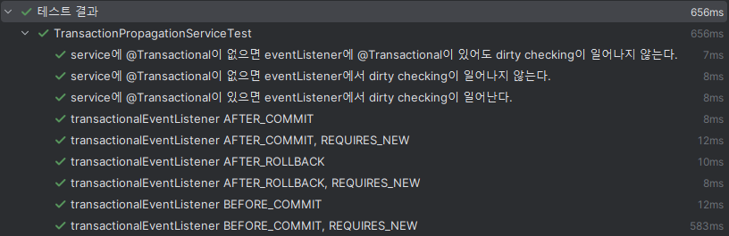

## 개요

Spring Boot에서 eventListener를 사용하는 경우가 종종 있는데, eventListener와 transactionalEventListener의 차이, transactionalEventListener의 phase 속성에 따라 동작 방식이 다 다르다. 따라서 이번 기회에 eventListener의 동작 방식과 트랜잭션과 엮이면 어떻게 동작하는지에 대해 정리해 보려고 한다.

## 문제

이번 포스팅에서는 위에서 기술한 각각의 방식에 따라 아래의 문제를 테스트한다.

-   eventListener에서 예외가 발생하면 예외가 service로 전파될까?
-   service의 @Transactional이 eventListener로 전파되고 커밋될까?

## 기본적으로 알아야 할 내용

아래는 eventListener와 @Transactional의 기본 동작 방식으로, 테스트 시 검증하지 않는다.

-   eventListener는 기존 service 로직과 동기적으로 동작한다.
-   JPA의 save 메소드에는 기본적으로 @Transactional이 존재하므로 외부에서 @Transactional을 선언해주지 않아도 DB에 저장된다. 
-   **동일한 트랜잭션**에 존재하는 entity 내 속성을 변경하면 update 쿼리가 동작한다. (dirty checking)
-   transactionalEventListener의 phase 속성 중 `AFTER_COMPLETION`은 `AFTER_COMMIT` + `AFTER_ROLLBACK`과 동일하다.

## 테스트 환경

먼저 Entity를 아래와 같이 구성한다.

```java
@Entity
@Table(name = "users")
@Getter
@NoArgsConstructor
public class User {

    @Id
    @GeneratedValue(strategy = GenerationType.IDENTITY)
    private Long id;

    private String name;

    public User(String name) {
        this.name = name;
    }

    public void updateUser(String name) {
        this.name = name;
    }
}
```

name 속성을 받는 생성자를 통해 Entity를 생성하고, `updateUser` 메소드로 dirty checking이 잘 되는지 (트랜잭션이 전파되었는지) 확인하는 방식으로 테스트를 진행해 보자.

> 동일한 테스트에서의 서비스 메소드, 이벤트 메소드의 동작은 모두 동일하게 구성하고, @Transactional의 유무와 eventListener의 구성만 달리하여 테스트를 진행한다.

## 예외 전파 테스트

eventListener에서 예외가 발생하면 예외가 service로 전파되고 트랜잭션이 롤백되는지 테스트를 하기 위해 아래와 같은 테스트 로직을 구성한다.

#### 테스트 절차
1. service에서 user를 생성하고 save한 후 이벤트를 보낸다.
2. eventListener에서 예외를 발생시킨다.

#### 예상 테스트 결과
- 예외가 전파되면 service에서 예외가 발생하고, 트랜잭션이 롤백되어 user가 생성되지 않는다.
- 예외가 전파되지 않으면 service에서 "성공"이 출력되고, 트랜잭션이 커밋되어 user가 생성된다.

테스트를 위해 service와 eventListener를 아래와 같이 구성해 보자.

#### service

```java
@Service
@RequiredArgsConstructor
public class ThrowPropagationService {

    private final UserRepository userRepository;
    private final ApplicationEventPublisher applicationEventPublisher;

    @Transactional
    public String eventListener() {
        userRepository.save(new User("service 생성"));
        applicationEventPublisher.publishEvent(new EventListener_ThrowEvent());
        return "성공";
    }

    @Transactional
    public String transactionalEventListener_BEFORE_COMMIT() {
        userRepository.save(new User("service 생성"));
        applicationEventPublisher.publishEvent(new BEFORE_COMMIT_ThrowEvent());
        return "성공";
    }

    @Transactional
    public String transactionalEventListener_AFTER_COMMIT() {
        userRepository.save(new User("service 생성"));
        applicationEventPublisher.publishEvent(new AFTER_COMMIT_ThrowEvent());
        return "성공";
    }
}
```

#### eventListener

```java
@Component
public class ThrowPropagationEventListener {

    @EventListener
    public void eventHandler(EventListener_ThrowEvent event) {
        throw new RuntimeException();
    }

    @TransactionalEventListener(phase = TransactionPhase.BEFORE_COMMIT)
    public void eventHandler(BEFORE_COMMIT_ThrowEvent event) {
        throw new RuntimeException();
    }

    @TransactionalEventListener(phase = TransactionPhase.AFTER_COMMIT)
    public void eventHandler(AFTER_COMMIT_ThrowEvent event) {
        throw new RuntimeException();
    }
}
```

### 테스트

테스트 코드를 아래와 같이 작성하고 실행해 보자.

```java
@SpringBootTest
class ThrowPropagationServiceTest {

    @Autowired
    private UserRepository userRepository;

    @Autowired
    private ThrowPropagationService throwPropagationService;

    @BeforeEach
    void setUp() {
        userRepository.deleteAllInBatch();
    }

    @DisplayName("eventListener에서 예외가 발생하면 service에서도 예외가 발생한다.")
    @Test
    void eventListener() {
        assertThrows(RuntimeException.class, () -> throwPropagationService.eventListener());

        assertEquals(0, userRepository.count());
    }

    @DisplayName("transactionalEventListener의 BEFORE_COMMIT에서 예외가 발생하면 service에서도 예외가 발생한다.")
    @Test
    void transactionalEventListener_BEFORE_COMMIT() {
        assertThrows(RuntimeException.class, () -> throwPropagationService.transactionalEventListener_BEFORE_COMMIT());

        assertEquals(0, userRepository.count());
    }

    @DisplayName("transactionalEventListener의 AFTER_COMMIT에서 예외가 발생해도 service에서 예외가 발생하지 않는다.")
    @Test
    void transactionalEventListener_AFTER_COMMIT() {
        assertEquals("성공", throwPropagationService.transactionalEventListener_AFTER_COMMIT());

        assertEquals(1, userRepository.count());
    }
}
```

테스트 결과는 아래와 같이 모두 성공했다.


### 결과 해석

- transactionalEventListener의 `AFTER_COMMIT`의 경우에만 예외가 발생해도 service로 전파되지 않았다.

그렇다면 예외가 전파되지 않는 이유는 무엇일까? 그 해답은 `TransactionSynchronizationUtils` 클래스에 있다.


코드를 보면 afterCompletion을 실행할 때 예외가 발생하면 `invokeAfterCompletion` 메소드에서 예외 로그만 발생시키고 통과하기 때문에 상위로 예외가 전파되지 않도록 구성되어 있음을 알 수 있다.

**이러한 구조는 service에서의 커밋이 성공된 이후의 transactionalEventListener에서의 동작은 Application의 실행 절차에 영향을 미치지 않도록 설계한 것으로 해석할 수 있다.**

## 트랜잭션 전파 테스트

service의 @Transactional이 eventListener에 전파되고 커밋되는지 테스트를 하기 위해 아래와 같은 테스트 로직을 구성한다.

#### 테스트 절차
1. service에서 user를 생성하고 save한 후 이벤트를 보낸다.
2. eventListener에서 `updateUser` 메소드를 통해 dirty checking 방식으로 이름을 수정한다.
3. eventListener에서 새로운 user를 생성한다.

#### 예상 테스트 결과
- 트랜잭션이 전파되면 service에서 생성한 user의 name이 수정된다.
- 트랜잭션이 전파되지 않으면 service에서 생성한 user의 name이 수정되지 않는다.
- listener에서 트랜잭션이 커밋될 수 있으면 listener에서 생성한 user가 존재한다.
- listener에서 트랜잭션이 커밋될 수 없으면 listener에서 생성한 user가 존재하지 않는다.

테스트를 위해 service와 eventListener를 아래와 같이 구성해 보자.
- 동작 시점을 확인하기 위해 user 생성 혹은 수정 시점을 출력하도록 구성한다.
- 트랜잭션 구동 시점을 확인하기 위해 `application.yml`에서 로깅을 아래와 같이 설정한다.
  ```yml
  logging:
    level:
      org.springframework.orm.jpa.JpaTransactionManager: debug
  ```

#### service

```java
@Service
@RequiredArgsConstructor
public class TransactionPropagationService {

    private final UserRepository userRepository;
    private final ApplicationEventPublisher applicationEventPublisher;

    public void eventListener_noTransactional() {
        System.out.println(">>>>>>>>>>>>>>> service 생성");
        User user = userRepository.save(new User("service 생성"));
        applicationEventPublisher.publishEvent(new EventListener_TransactionEvent(user));
    }

    @Transactional
    public void eventListener_hasTransactional() {
        System.out.println(">>>>>>>>>>>>>>> service 생성");
        User user = userRepository.save(new User("service 생성"));
        applicationEventPublisher.publishEvent(new EventListener_TransactionEvent(user));
    }

    public void eventListener_newTransactional() {
        System.out.println(">>>>>>>>>>>>>>> service 생성");
        User user = userRepository.save(new User("service 생성"));
        applicationEventPublisher.publishEvent(new EventListener_NewTransactionEvent(user));
    }

    @Transactional
    public void transactionalEventListener_BEFORE_COMMIT() {
        System.out.println(">>>>>>>>>>>>>>> service 생성");
        User user = userRepository.save(new User("service 생성"));
        applicationEventPublisher.publishEvent(new BEFORE_COMMIT_TransactionEvent(user));
    }

    @Transactional
    public void newTransactionalEventListener_BEFORE_COMMIT() {
        System.out.println(">>>>>>>>>>>>>>> service 생성");
        User user = userRepository.save(new User("service 생성"));
        applicationEventPublisher.publishEvent(new BEFORE_COMMIT_NewTransactionEvent(user));
    }

    @Transactional
    public void transactionalEventListener_AFTER_COMMIT() {
        System.out.println(">>>>>>>>>>>>>>> service 생성");
        User user = userRepository.save(new User("service 생성"));
        applicationEventPublisher.publishEvent(new AFTER_COMPLETION_TransactionEvent(user));
    }

    @Transactional
    public void newTransactionalEventListener_AFTER_COMMIT() {
        System.out.println(">>>>>>>>>>>>>>> service 생성");
        User user = userRepository.save(new User("service 생성"));
        applicationEventPublisher.publishEvent(new AFTER_COMPLETION_NewTransactionEvent(user));
    }

    @Transactional
    public void transactionalEventListener_AFTER_ROLLBACK() {
        System.out.println(">>>>>>>>>>>>>>> service 생성");
        User user = userRepository.save(new User("service 생성"));
        applicationEventPublisher.publishEvent(new AFTER_COMPLETION_TransactionEvent(user));
        throw new RuntimeException();
    }

    @Transactional
    public void newTransactionalEventListener_AFTER_ROLLBACK() {
        System.out.println(">>>>>>>>>>>>>>> service 생성");
        User user = userRepository.save(new User("service 생성"));
        applicationEventPublisher.publishEvent(new AFTER_COMPLETION_NewTransactionEvent(user));
        throw new RuntimeException();
    }
}
```

#### eventListener

```java
@Component
@RequiredArgsConstructor
public class TransactionPropagationEventListener {

    private final UserRepository userRepository;

    @EventListener
    public void eventHandler(EventListener_TransactionEvent event) {
        User user = event.getUser();
        user.updateUser("dirty checking 수정");

        System.out.println(">>>>>>>>>>>>>>> listener 생성");
        userRepository.save(new User("listener 생성"));
    }

    @Transactional
    @EventListener
    public void eventHandler(EventListener_NewTransactionEvent event) {
        User user = event.getUser();
        user.updateUser("dirty checking 수정");

        System.out.println(">>>>>>>>>>>>>>> listener 생성");
        userRepository.save(new User("listener 생성"));
    }

    @TransactionalEventListener(phase = TransactionPhase.BEFORE_COMMIT)
    public void eventHandler(BEFORE_COMMIT_TransactionEvent event) {
        User user = event.getUser();
        user.updateUser("dirty checking 수정");

        System.out.println(">>>>>>>>>>>>>>> listener 생성");
        userRepository.save(new User("listener 생성"));
    }

    @Transactional(propagation = Propagation.REQUIRES_NEW)
    @TransactionalEventListener(phase = TransactionPhase.BEFORE_COMMIT)
    public void eventHandler(BEFORE_COMMIT_NewTransactionEvent event) {
        User user = event.getUser();
        user.updateUser("dirty checking 수정");

        System.out.println(">>>>>>>>>>>>>>> listener 생성");
        userRepository.save(new User("listener 생성"));
    }

    @TransactionalEventListener(phase = TransactionPhase.AFTER_COMPLETION)
    public void eventHandler(AFTER_COMPLETION_TransactionEvent event) {
        User user = event.getUser();
        user.updateUser("dirty checking 수정");

        System.out.println(">>>>>>>>>>>>>>> listener 생성");
        userRepository.save(new User("listener 생성"));
    }

    @Transactional(propagation = Propagation.REQUIRES_NEW)
    @TransactionalEventListener(phase = TransactionPhase.AFTER_COMPLETION)
    public void eventHandler(AFTER_COMPLETION_NewTransactionEvent event) {
        User user = event.getUser();
        user.updateUser("dirty checking 수정");

        System.out.println(">>>>>>>>>>>>>>> listener 생성");
        userRepository.save(new User("listener 생성"));
    }
}
```

### 테스트

테스트 코드를 아래와 같이 작성하고 실행해 보자. (transactionalEventListener 테스트 시에는 `@DisplayName`이 너무 길어져서 속성만 명시하였다.)

```java
@SpringBootTest
class TransactionPropagationServiceTest {

    @Autowired
    private UserRepository userRepository;

    @Autowired
    private TransactionPropagationService transactionPropagationService;

    @BeforeEach
    void setUp() {
        userRepository.deleteAllInBatch();
    }

    @DisplayName("service에 @Transactional이 없으면 eventListener에서 dirty checking이 일어나지 않는다.")
    @Test
    void eventListener_noTransactional() {
        transactionPropagationService.eventListener_noTransactional();

        List<User> userList = userRepository.findAll();
        assertEquals(2, userList.size());
        assertEquals("service 생성", userList.get(0).getName());
        assertEquals("listener 생성", userList.get(1).getName());
    }

    @DisplayName("service에 @Transactional이 있으면 eventListener에서 dirty checking이 일어난다.")
    @Test
    void eventListener_hasTransactional() {
        transactionPropagationService.eventListener_hasTransactional();

        List<User> userList = userRepository.findAll();
        assertEquals(2, userList.size());
        assertEquals("dirty checking 수정", userList.get(0).getName());
        assertEquals("listener 생성", userList.get(1).getName());
    }

    @DisplayName("service에 @Transactional이 없으면 eventListener에 @Transactional이 있어도 dirty checking이 일어나지 않는다.")
    @Test
    void eventListener_newTransactional() {
        transactionPropagationService.eventListener_newTransactional();

        List<User> userList = userRepository.findAll();
        assertEquals(2, userList.size());
        assertEquals("service 생성", userList.get(0).getName());
        assertEquals("listener 생성", userList.get(1).getName());
    }

    @DisplayName("transactionalEventListener BEFORE_COMMIT")
    @Test
    void transactionalEventListener_BEFORE_COMMIT() {
        transactionPropagationService.transactionalEventListener_BEFORE_COMMIT();

        List<User> userList = userRepository.findAll();
        assertEquals(2, userList.size());
        assertEquals("dirty checking 수정", userList.get(0).getName());
        assertEquals("listener 생성", userList.get(1).getName());
    }

    @DisplayName("transactionalEventListener BEFORE_COMMIT, REQUIRES_NEW")
    @Test
    void newTransactionalEventListener_BEFORE_COMMIT() {
        transactionPropagationService.newTransactionalEventListener_BEFORE_COMMIT();

        List<User> userList = userRepository.findAll();
        assertEquals(2, userList.size());
        assertEquals("dirty checking 수정", userList.get(0).getName());
        assertEquals("listener 생성", userList.get(1).getName());
    }

    @DisplayName("transactionalEventListener AFTER_COMMIT")
    @Test
    void transactionalEventListener_AFTER_COMMIT() {
        transactionPropagationService.transactionalEventListener_AFTER_COMMIT();

        List<User> userList = userRepository.findAll();
        assertEquals(1, userList.size());
        assertEquals("service 생성", userList.get(0).getName());
    }

    @DisplayName("transactionalEventListener AFTER_COMMIT, REQUIRES_NEW")
    @Test
    void newTransactionalEventListener_AFTER_COMMIT() {
        transactionPropagationService.newTransactionalEventListener_AFTER_COMMIT();

        List<User> userList = userRepository.findAll();
        assertEquals(2, userList.size());
        assertEquals("service 생성", userList.get(0).getName());
        assertEquals("listener 생성", userList.get(1).getName());
    }

    @DisplayName("transactionalEventListener AFTER_ROLLBACK")
    @Test
    void transactionalEventListener_AFTER_ROLLBACK() {
        assertThrows(RuntimeException.class, () -> transactionPropagationService.transactionalEventListener_AFTER_ROLLBACK());

        List<User> userList = userRepository.findAll();
        assertEquals(0, userList.size());
    }

    @DisplayName("transactionalEventListener AFTER_ROLLBACK, REQUIRES_NEW")
    @Test
    void newTransactionalEventListener_AFTER_ROLLBACK() {
        assertThrows(RuntimeException.class, () -> transactionPropagationService.newTransactionalEventListener_AFTER_ROLLBACK());

        List<User> userList = userRepository.findAll();
        assertEquals(1, userList.size());
        assertEquals("listener 생성", userList.get(0).getName());
    }
}
```

테스트 결과는 아래와 같이 모두 성공했다.



### 결과 해석

- service에 @Transactional이 존재하지 않거나 롤백되었다면 dirty checking이 동작하지 않는다.
- service에 @Transactional이 존재하고 롤백되지 않았다면 transactionalEventListener의 `AFTER_COMMIT`의 경우에만 dirty checking이 동작하지 않는다.
- transactionalEventListener의 `AFTER_COMMIT`, `AFTER_ROLLBACK`에서는 `@Transactional(propagation = Propagation.REQUIRES_NEW)`이 존재하지 않으면 트랜잭션이 커밋되지 않는다.

service에 @Transactional이 존재하지 않으면 dirty checking이 동작하지 않는 것은 같은 트랜잭션으로 묶여있지 않기 때문에 트랜잭션의 원리를 알고 있다면 예상할 수 있었을 것이다.

그렇다면 service에 @Transactional이 존재할 때, `AFTER_COMMIT`, `AFTER_ROLLBACK`에서는 왜 커밋이 일어나지 않을까? save 메소드에는 @Transactional이 달려있다고 했는데, 트랜잭션이 커밋된 이후라면 새로운 트랜잭션이 생기고 커밋돼야 하는 것 아닐까?

답은 아래의 `AFTER_COMMIT` 테스트 실행 로그에서 찾을 수 있다. 


service에서 생성된 트랜잭션을 통해 service에서 생성한 user의 insert문이 동작한 이후 트랜잭션이 커밋되고 나서, **새로운 트랜잭션이 생성되지 않고** dirty checking과 listener에서의 생성 로그가 찍혔다. 그렇다는 건 기존에 트랜잭션이 전파되었다는 뜻인데, 과연 진짜일까?
 
아래는 listener에서의 save 메소드를 통과한 이후 `AbstractPlatformTransactionManager`의 `processCommit` 메소드를 디버깅한 사진이다. 여기에서 해답을 찾을 수 있다.


`sessionImpl` 값이 위의 테스트 실행 로그에서 확인한 `sessionImpl` 값과 동일하다. 따라서 service에서 생성된 트랜잭션이 전파되었음을 확인할 수 있다. 트랜잭션에서는 `newTransaction` 값이 true여야 `doCommit`을 통해 커밋이 이루어지는데, 여기에서는 `newTransaction` 값이 false이므로 커밋이 이루어지지 않는다.

**이러한 구조는 하나의 트랜잭션에서는 한 번의 커밋 혹은 롤백만을 수행하도록 설계된 부분으로 해석할 수 있다.** 따라서 이러한 경우에는 `@Transactional(propagation = Propagation.REQUIRES_NEW)` 속성이 있어야만 새로운 트랜잭션이 생성되어 커밋이 정상적으로 이루어지게 된다.

## 정리

길었던 테스트 여정이 끝났다. 테스트 결과를 요약하면 다음과 같다.

- 트랜잭션이 커밋된 이후(`AFTER_COMMIT`) 동작하는 transactionalEventListener는 상위 메소드로 예외를 전파하지 않는다.
- eventListener, transactionalEventListener 모두 상위 트랜잭션을 전파받는다.
- 하나의 트랜잭션은 한 번의 커밋 혹은 롤백만을 수행한다.

## 마무리

항상 포스팅으로 남겨서 공유하기 위해 정리하다 보면 꼭 내가 가장 많이 배우고 끝난다. eventListener를 사용할 때마다 긴가민가한 부분이 있어 간단히 정리하기 위해 시작했는데, 트랜잭션의 동작 원리까지 뜯어보고 이해하는 계기가 되었다.

모든 코드는 [GitHub](https://github.com/psh10066/blog-code/tree/main/eventListener-example)에서 확인하실 수 있습니다. :)